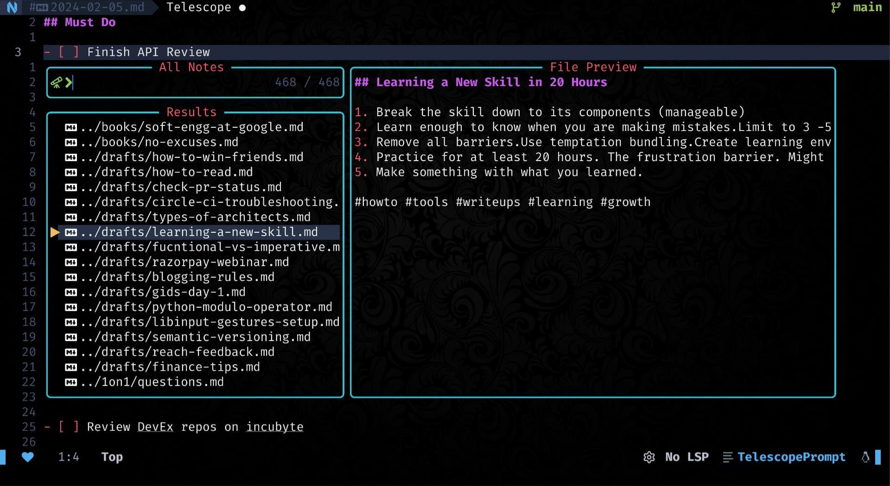

<div align = "center">

<h1><a href="https://github.com/2kabhishek/tdo.nvim">tdo.nvim</a></h1>

<a href="https://github.com/2KAbhishek/tdo.nvim/blob/main/LICENSE">
 </a>

<a href="https://github.com/2KAbhishek/tdo.nvim/graphs/contributors">
 </a>

<a href="https://github.com/2KAbhishek/tdo.nvim/stargazers">
</a>

<a href="https://github.com/2KAbhishek/tdo.nvim/network/members">
 </a>

<a href="https://github.com/2KAbhishek/tdo.nvim/watchers">
 </a>

<a href="https://github.com/2KAbhishek/tdo.nvim/pulse">
 </a>

<h3>Fast & Simple Note Taking in Neovim! 📃🚀</h3>

<figure>
  
  <br/>
  <figcaption>tdo.nvim in action</figcaption>
</figure>

</div>

tdo.nvim integrates [tdo](https://github.com/2kabhishek/tdo) into your neovim workflow to make managing notes and todos super simple and fast. [Demo video](https://youtu.be/N4IRT7M-RLg)

## ✨ Features

- All features provided by [tdo](https://github.com/2kabhishek/tdo?tab=readme-ov-file#-features)
- Various commands to make working with tdo seamless
- Todo navigation and toggle helpers
- Integration with telescope for easy notes searching

## ⚡ Setup

### ⚙️ Requirements

- neovim
- [tdo](https://github.com/2kabhishek/tdo)
- telescope.nvim

### 💻 Installation

Add the following to your lazy/packer config

```lua
    -- Lazy
    {
        '2kabhishek/tdo.nvim',
        dependencies =  'nvim-telescope/telescope.nvim',
        cmd = { 'Tdo', 'TdoEntry', 'TdoNote', 'TdoTodos', 'TdoToggle', 'TdoFind', 'TdoFiles' },
        keys = { '[t', ']t' },
    },

    -- Packer
    use '2kabhishek/tdo.nvim'
```

## 🚀 Usage

### 📡 Commands

`tdo.nvim` adds the following commands:

- `Tdo <args>`: open today's todo when no `args`, accepts `args` same as [tdo](https://github.com/2kabhishek/tdo?tab=readme-ov-file#-usage)
- `TdoEntry <offset>`: open today's journal entry, accepts `offset`
- `TdoNote`: create new note with title, if left empty creates a draft with current timestamp
- `TdoTodos`: show all your incomplete todos
- `TdoToggle`: toggle todo state
- `TdoFind <text>`: interactively search for `text` in all your notes
- `TdoFiles`: review all your notes

### ⌨️ Mappings

`tdo.nvim` adds the following mappings:

- <kbd>[t</kbd> / <kbd>]t</kbd> — Go to previous/next todo `[ ]`

#### Recommended which-key Mappings

Other than the standard commands, you can use which-key to create your own commands.

I have defined commands for yesterday/tomorrow's todos, commit note and timestamp insertion.

```lua
    n = {
        name = 'Notes',
        d = { '<cmd>Tdo<cr>', "Today's Todo" },
        e = { '<cmd>TdoEntry<cr>', "Today's Entry" },
        f = { '<cmd>TdoFiles<cr>', 'All Notes' },
        g = { '<cmd>TdoFind<cr>', 'Find Notes' },
        h = { '<cmd>Tdo -1<cr>', "Yesterday's Todo" },
        j = { "<cmd>put =strftime('%a %d %b %r')<cr>", 'Insert Human Date' },
        J = { "<cmd>put =strftime('%F')<cr>", 'Insert Date' },
        k = { "<cmd>put =strftime('%r')<cr>", 'Insert Human Time' },
        K = { "<cmd>put =strftime('%F-%H-%M')<cr>", 'Insert Time' },
        l = { '<cmd>Tdo 1<cr>', "Tomorrow's Todo" },
        n = { '<cmd>TdoNote<cr>', 'New Note' },
        s = { '<cmd>lua require("tdo").run_with("commit " .. vim.fn.expand("%:p")) vim.notify("Commited!")<cr>', 'Commit Note', },
        t = { '<cmd>TdoTodos<cr>', 'Incomplete Todos' },
        x = { '<cmd>TdoToggle<cr>', 'Toggle Todo' },
    },
```

## 🏗️ What's Next

You tell me!

## 🧑‍💻 Behind The Code

### 🌈 Inspiration

Most note-taking systems offer a lot more than I needed, so I wrote [tdo](https://github.com/2kabhishek/tdo) and then tdo.nvim for better integration.

### 💡 Challenges/Learnings

- Dove deeper into nvim APIs
- Learned about not interactive shell scripting.

### 🧰 Tooling

- [dots2k](https://github.com/2kabhishek/dots2k) — Dev Environment
- [nvim2k](https://github.com/2kabhishek/nvim2k) — Personalized Editor
- [sway2k](https://github.com/2kabhishek/sway2k) — Desktop Environment
- [qute2k](https://github.com/2kabhishek/qute2k) — Personalized Browser

### 🔍 More Info

- [co-author.nvim](https://github.com/2kabhishek/co-author.nvim) — Easily add git co authors
- [nerdy.nvim](https://github.com/2kabhishek/nerdy.nvim) — Easily add nerd glyphs

<hr>

<div align="center">

<strong>⭐ hit the star button if you found this useful ⭐</strong><br>

<a href="https://github.com/2KAbhishek/tdo.nvim">Source</a>
| <a href="https://2kabhishek.github.io/blog" target="_blank">Blog </a>
| <a href="https://twitter.com/2kabhishek" target="_blank">Twitter </a>
| <a href="https://linkedin.com/in/2kabhishek" target="_blank">LinkedIn </a>
| <a href="https://2kabhishek.github.io/links" target="_blank">More Links </a>
| <a href="https://2kabhishek.github.io/projects" target="_blank">Other Projects </a>

</div>
