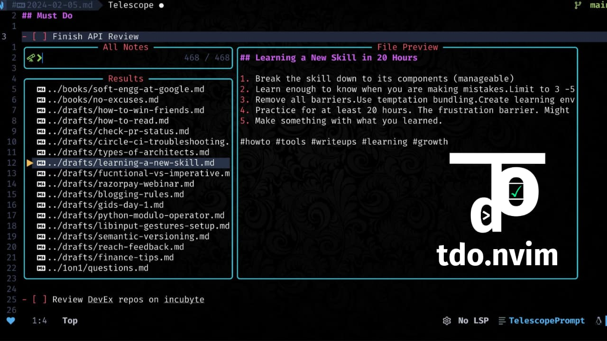

<div align = "center">

<h1><a href="https://github.com/2kabhishek/tdo.nvim">tdo.nvim</a></h1>

<a href="https://github.com/2KAbhishek/tdo.nvim/blob/main/LICENSE">
 </a>

<a href="https://github.com/2KAbhishek/tdo.nvim/graphs/contributors">
 </a>

<a href="https://github.com/2KAbhishek/tdo.nvim/stargazers">
</a>

<a href="https://github.com/2KAbhishek/tdo.nvim/network/members">
 </a>

<a href="https://github.com/2KAbhishek/tdo.nvim/watchers">
 </a>

<a href="https://github.com/2KAbhishek/tdo.nvim/pulse">
 </a>

<h3>Fast & Simple Notes in Neovim 📃🚀</h3>

<figure>
  
  <br/>
  <figcaption>tdo.nvim in action</figcaption>
</figure>

</div>

tdo.nvim integrates [tdo](https://github.com/2kabhishek/tdo) into your neovim workflow to make managing notes and todos super simple and fast. [Demo video](https://youtu.be/N4IRT7M-RLg)

## ✨ Features

- All features provided by [tdo](https://github.com/2kabhishek/tdo?tab=readme-ov-file#-features)
- Various commands to make working with tdo seamless
- Todo navigation and toggle helpers
- Fuzzy autocompletion for notes navigation
- Integration with various pickers via [pickme.nvim](https://github.com/2kabhishek/pickme.nvim) for easy notes searching

## ⚡ Setup

### ⚙️ Requirements

- [tdo](https://github.com/2kabhishek/tdo) must be setup
- [pickme.nvim](https://github.com/2kabhishek/pickme.nvim) for picker support

### 💻 Installation

Add the following to your lazy/packer config

```lua
    -- Lazy
    {
        '2kabhishek/tdo.nvim',
        dependencies =  '2kabhishek/pickme.nvim',
        cmd = { 'Tdo', 'TdoEntry', 'TdoNote', 'TdoTodos', 'TdoToggle', 'TdoFind', 'TdoFiles' },
        keys = { '[t', ']t' },
    },

    -- Packer
    use '2kabhishek/tdo.nvim'
```

## 🚀 Usage

### 📡 Commands

`tdo.nvim` adds the following commands:

- `Tdo <args>`: open today's todo when no `args`, accepts `args` same as [tdo](https://github.com/2kabhishek/tdo?tab=readme-ov-file#-usage)
  - Supports tab completion for file paths and fuzzy matching
- `TdoEntry <offset>`: open today's journal entry, accepts `offset`
- `TdoNote`: create new note with title, if left empty creates a draft with current timestamp
- `TdoTodos`: show all your incomplete todos
- `TdoToggle`: toggle todo state
- `TdoFind <text>`: interactively search for `text` in all your notes
- `TdoFiles`: review all your notes

### ⌨️ Keybindings

By default, these are the configured keybindings.

| Keybinding        | Command                                            | Description         |
| ----------------- | -------------------------------------------------- | ------------------- |
| `<leader>nn`      | `:Tdo<CR>`                                         | Today's Todo        |
| `<leader>ne`      | `:Tdo entry<CR>`                                   | Today's Entry       |
| `<leader>nf`      | `:Tdo files<CR>`                                   | All Notes           |
| `<leader>ng`      | `:Tdo find<CR>`                                    | Find Notes          |
| `<leader>nh`      | `:Tdo yesterday<CR>`                               | Yesterday's Todo    |
| `<leader>nl`      | `:Tdo tomorrow<CR>`                                | Tomorrow's Todo     |
| `<leader>nc`      | `:Tdo note<CR>`                                    | Create Note         |
| `<leader>ns`      | `:lua require("tdo.notes").run_with("commit")<CR>` | Commit Note         |
| `<leader>nt`      | `:Tdo todos<CR>`                                   | Incomplete Todos    |
| `<leader>nx`      | `:Tdo toggle<CR>`                                  | Toggle Todo         |
| `]t`              | `/\v\[ \]\_s*[^[]<CR>:noh<CR>`                     | Next Todo           |
| `[t`              | `?\v\[ \]\_s*[^[]<CR>:noh<CR>`                     | Prev Todo           |
| `<leader>nd[1-9]` | `:Tdo [1-9]<CR>`                                   | Todo N Days Later   |
| `<leader>nD[1-9]` | `:Tdo -[1-9]<CR>`                                  | Todo N Days Ago     |
| `<leader>nw[1-9]` | `:Tdo [1-9]-weeks-later<CR>`                       | Todo N Weeks Later  |
| `<leader>nW[1-9]` | `:Tdo [1-9]-weeks-ago<CR>`                         | Todo N Weeks Ago    |
| `<leader>nm[1-9]` | `:Tdo [1-9]-months-later<CR>`                      | Todo N Months Later |
| `<leader>nM[1-9]` | `:Tdo [1-9]-months-ago<CR>`                        | Todo N Months Ago   |
| `<leader>ny[1-9]` | `:Tdo [1-9]-years-later<CR>`                       | Todo N Years Later  |
| `<leader>nY[1-9]` | `:Tdo [1-9]-years-ago<CR>`                         | Todo N Years Ago    |

I recommend customizing these keybindings based on your preferences.

**Note:** Keybindings are only active when `add_default_keybindings = true` in your configuration.

## 🏗️ What's Next

You tell me!

## 🧑‍💻 Behind The Code

### 🌈 Inspiration

Most note-taking systems offer a lot more than I needed, so I wrote [tdo](https://github.com/2kabhishek/tdo) and then tdo.nvim for better integration.

### 💡 Challenges/Learnings

- Dove deeper into nvim APIs
- Learned about not interactive shell scripting.

### 🧰 Tooling

- [dots2k](https://github.com/2kabhishek/dots2k) — Dev Environment
- [nvim2k](https://github.com/2kabhishek/nvim2k) — Personalized Editor
- [sway2k](https://github.com/2kabhishek/sway2k) — Desktop Environment
- [qute2k](https://github.com/2kabhishek/qute2k) — Personalized Browser

### 🔍 More Info

- [co-author.nvim](https://github.com/2kabhishek/co-author.nvim) — Easily add git co authors
- [nerdy.nvim](https://github.com/2kabhishek/nerdy.nvim) — Easily add nerd glyphs

<hr>

<div align="center">

<strong>⭐ hit the star button if you found this useful ⭐</strong><br>

<a href="https://github.com/2KAbhishek/tdo.nvim">Source</a>
| <a href="https://2kabhishek.github.io/blog" target="_blank">Blog </a>
| <a href="https://twitter.com/2kabhishek" target="_blank">Twitter </a>
| <a href="https://linkedin.com/in/2kabhishek" target="_blank">LinkedIn </a>
| <a href="https://2kabhishek.github.io/links" target="_blank">More Links </a>
| <a href="https://2kabhishek.github.io/projects" target="_blank">Other Projects </a>

</div>
